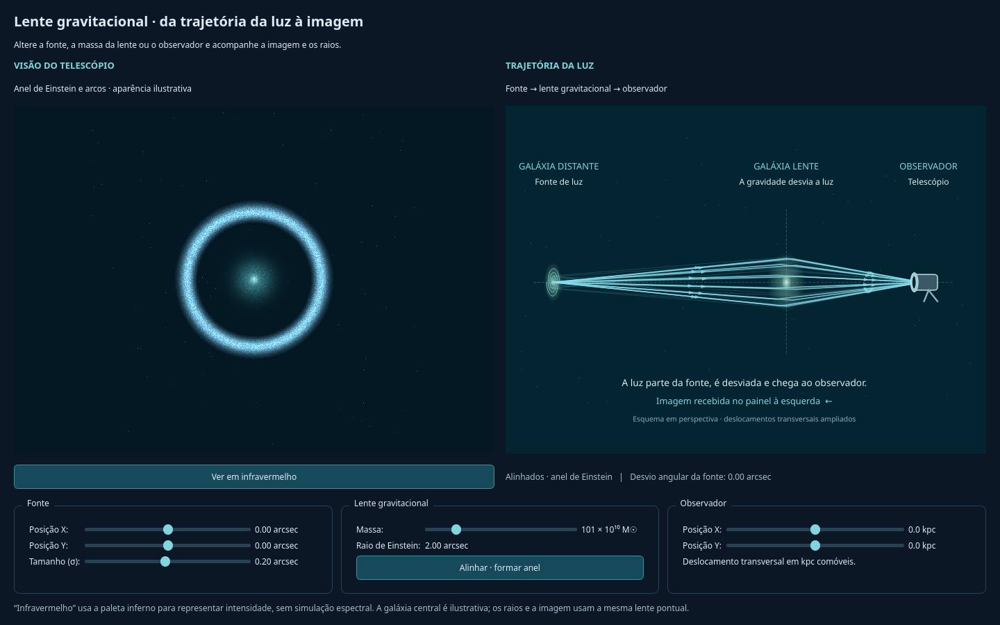
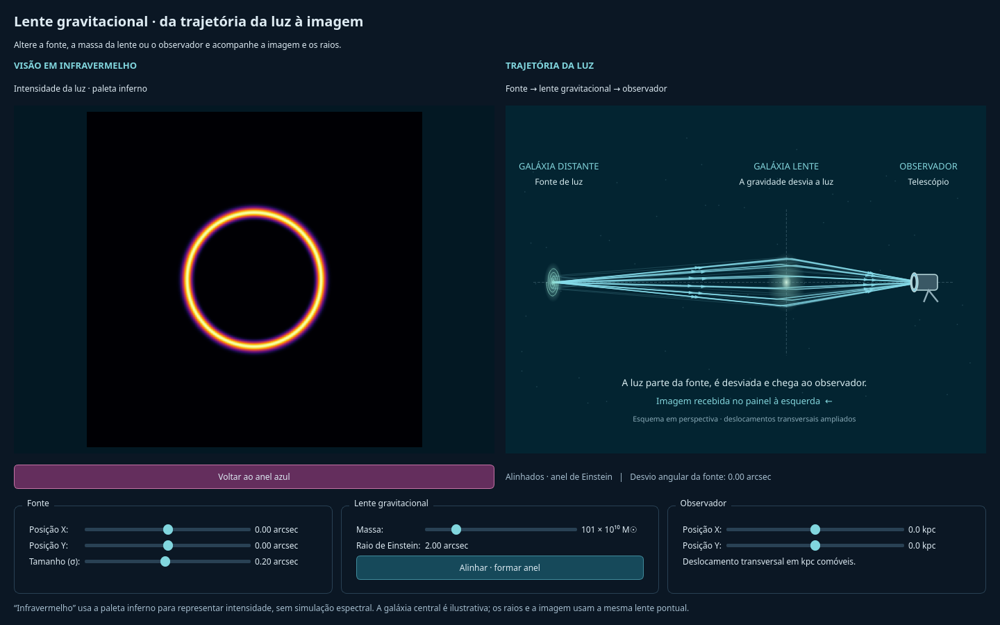

# Relatório técnico — Simulador de Lente Gravitacional

**Data da análise:** 27 de setembro de 2026  
**Objeto:** código presente no diretório de trabalho, incluindo alterações ainda não commitadas.  
**Commit de referência:** `f49ea6b694ed78327749d3444f672ffc0952e578` — identifica a base do repositório, não toda a versão analisada.  
**Método:** leitura dos módulos e testes; execução de 13 testes; coleta de parâmetros, versões, hashes e tempos; consulta à documentação técnica primária.  
**Escopo:** explicar a implementação atual, suas equações, escolhas visuais e limites. A produção deste relatório não modifica os módulos do simulador.

## 1. O que o programa faz

O programa é uma aplicação desktop didática de lente gravitacional. Calcula como uma fonte luminosa circular gaussiana seria vista através de uma lente de massa pontual. A janela combina uma imagem calculada, à esquerda, com um esquema de propagação da luz, à direita.

A massa da lente determina a intensidade da deflexão. A posição e o tamanho angular da fonte determinam quais regiões da imagem recebem luz. O deslocamento transversal do observador muda o alinhamento aparente. Os seis sliders atualizam o mesmo estado físico utilizado pelos dois painéis.

A imagem admite duas apresentações: um resultado azul com textura, estrelas e galáxia central ilustrativas; e a intensidade escalar na paleta inferno, chamada de “infravermelho” na interface. O segundo modo não calcula comprimentos de onda, emissão térmica nem resposta de sensores.

O programa implementa uma solução aproximada de óptica gravitacional. Não integra as equações completas da relatividade geral, não acompanha partículas reais e não reconstrói a massa de uma galáxia observada. Seu uso mais apropriado é explorar alinhamento, formação de anéis, separação de imagens e dependência com massa e tamanho da fonte.

### 1.1 Como ler as duas vistas

A imagem da esquerda está no **plano angular observado**, centrado na lente. Cada pixel representa uma direção de observação. As cores decorativas não são a distribuição de massa.

O painel da direita é uma projeção oblíqua de três planos: fonte, lente e observador. Seus raios usam soluções da mesma equação da imagem, mas comprimentos, ícones e ângulos aparentes na tela foram ajustados para legibilidade. Não se deve medir um ângulo diretamente no desenho para obter a deflexão astronômica.

A fonte desenhada como uma pequena espiral é um ícone. A fonte matemática usada na renderização é uma gaussiana sem braços espirais. Analogamente, o halo luminoso desenhado na lente não representa um perfil de massa estendido: o campo gravitacional continua sendo pontual.

### 1.2 Prévias da interface

As figuras abaixo foram geradas na validação de 26/09/2026, em modo offscreen. Ilustram o layout e as duas apresentações; não comprovam que a janela seja apresentada corretamente pelo WSLg.



*Figura 1 — Configuração alinhada no modo azul.*



*Figura 2 — Mesma configuração física apresentada na paleta inferno.*

## 2. Arquitetura e organização

| Arquivo | Responsabilidade |
|---|---|
| `main.py` | Define valores iniciais, escolhe a plataforma Qt no WSL, cria os objetos e inicia o event loop. |
| `core/cosmologia.py` | Calcula as três distâncias de diâmetro angular usando Astropy. |
| `core/equacoes.py` | Guarda massa, redshifts, distâncias e raio de Einstein; aplica a equação inversa. |
| `core/geometria.py` | Resolve as imagens pontuais, calcula paralaxe e monta os raios do esquema. |
| `render/gerador_fonte.py` | Avalia a distribuição de intensidade gaussiana. |
| `render/ray_tracing.py` | Cria a malha angular, calcula o frame escalar e produz a aparência RGB. |
| `ui/janela.py` | Monta a janela, controla sliders, agenda atualizações e alterna o modo visual. |
| `ui/diagrama.py` | Projeta os pontos e desenha raios, fonte, lente e telescópio com QPainter. |
| `tests/test_visualizacoes.py` | Testes do modelo, das imagens, da geometria e da interface. |
| `tests/test_plataforma.py` | Testes da seleção do backend Qt. |
| `requeriments.txt` | Lista versões declaradas de pacotes; o nome contém essa grafia no repositório. |
| `README.md` | Orientações resumidas de uso e interpretação. |

Os arquivos `__init__.py` delimitam os pacotes. O projeto não contém servidor web, banco de dados, autenticação ou serviço remoto. A aplicação em si não implementa envio de dados pela rede.

### 2.1 Fluxo de uma atualização

```text
Slider valueChanged
   └─ agendar_render() → QTimer de 16 ms
       └─ atualizar_render()
           ├─ ler sliders e converter unidades
           ├─ atualizar massa e theta_E
           ├─ calcular_geometria() → beta_efetivo e raios
           ├─ renderizar_frame() → intensidade uint8
           ├─ renderizar_telescopio() → RGB uint8
           ├─ diagrama.atualizar() → solicitar pintura
           ├─ exibir_imagem() → escolher RGB ou inferno
           └─ atualizar textos e indicadores
```

São calculados os dois buffers de imagem em cada atualização física, mesmo quando apenas um está visível. A troca de paleta, sozinha, reutiliza os buffers e não precisa recalcular a física.

## 3. Símbolos, unidades e convenções

| Símbolo | Significado | Unidade interna |
|---|---|---|
| \(M\) | Massa pontual da lente | kg |
| \(G\) | Constante gravitacional | m³ kg⁻¹ s⁻² |
| \(c\) | Velocidade da luz | m s⁻¹ |
| \(z_l,z_s\) | Redshifts da lente e da fonte | Adimensionais |
| \(D_l,D_s,D_{ls}\) | Distâncias de diâmetro angular | m |
| \(\chi_l,\chi_s\) | Distâncias comóveis radiais | m |
| \(\boldsymbol\theta\) | Direção angular da imagem em relação à lente | rad |
| \(\boldsymbol\beta\) | Direção da fonte relativa à lente sem deflexão | rad |
| \(\theta_E\) | Raio angular de Einstein | rad |
| \(\sigma\) | Largura angular da gaussiana | rad |
| \(\boldsymbol b\) | Deslocamento transversal comóvel do observador | m, recebido em kpc |
| \(f\) | Razão \(\chi_l/\chi_s\) | Adimensional |
| \(I\) | Intensidade relativa antes da apresentação | Escala 0–255 |

Constantes codificadas: \(G=6{,}67430\times10^{-11}\), \(c=299\,792\,458\), \(M_\odot=1{,}989\times10^{30}\) kg, 1 Mpc = \(3{,}08567758\times10^{22}\) m e 1 kpc = \(3{,}08567758\times10^{19}\) m.

A conversão angular é:

\[
1''=\frac{\pi}{180\times3600}\ {\rm rad}
   \simeq4{,}848136811\times10^{-6}\ {\rm rad}.
\]

As matrizes usam linha para Y e coluna para X. O `ImageItem(axisOrder="row-major")` mantém essa convenção tanto para intensidade quanto para RGB. Os eixos da imagem e os eixos da projeção oblíqua não têm a mesma orientação na tela.

## 4. Cosmologia adotada

O objeto é criado por `FlatLambdaCDM(H0=67.4, Om0=0.315)`. O modelo tem curvatura espacial nula, constante cosmológica e densidade de matéria de 0,315 na época atual. No ambiente inspecionado, `Tcmb0=0 K` e `Ob0=0` são valores padrão.

Embora o comentário no código faça referência a “Plank 2018”, não é usado o objeto predefinido `Planck18`. São dois parâmetros próximos aos usualmente associados a essa cosmologia, sem reproduzir toda a parametrização. A documentação de Astropy esclarece que `Tcmb0=0` desativa fótons e neutrinos no cálculo cosmológico. [Astropy: FlatLambdaCDM](https://docs.astropy.org/en/stable/api/astropy.cosmology.FlatLambdaCDM.html)

Para explicar as distâncias desse modelo simplificado, podemos escrever:

\[
H(z)=H_0\sqrt{\Omega_{m0}(1+z)^3+\Omega_{\Lambda0}},\qquad
\chi(z)=c\int_0^z\frac{dz'}{H(z')},
\]

\[
D_l=\frac{\chi_l}{1+z_l},\quad
D_s=\frac{\chi_s}{1+z_s},\quad
D_{ls}=\frac{\chi_s-\chi_l}{1+z_s}.
\]

Essas expressões explicam o papel de Astropy; o projeto não implementa sua própria quadratura. No código, as chamadas retornam quantidades em Mpc, das quais se extrai `.value` e se aplica a conversão para metros.

**Não se deve substituir \(D_{ls}\) por \(D_s-D_l\).** As distâncias de diâmetro angular não são coordenadas euclidianas aditivas entre objetos em redshifts distintos.

O teste explícito da função é apenas \(z_l<z_s\). A interface não fornece sliders de redshift. Alterações por código devem respeitar também distâncias positivas e finitas.

## 5. Modelo físico da lente

### 5.1 Hipóteses

A aproximação reúne lente fina, massa pontual, simetria esférica, campo fraco na região atravessada pelos raios e pequenos ângulos. A deflexão é concentrada em um plano. O observador, a lente e a fonte são tratados como uma configuração estática em cada quadro.

O projeto não calcula geodésicas em uma métrica, movimento orbital, dinâmica de galáxias, atraso temporal entre imagens, efeitos de onda ou múltiplos planos de lente. A base teórica de lente fina e massa pontual pode ser consultada nas [notas de Narayan e Bartelmann](https://arxiv.org/abs/astro-ph/9606001); as expressões abaixo são identificadas diretamente na implementação e desenvolvidas algebricamente aqui.

### 5.2 Da deflexão ao raio de Einstein

Para um impacto físico \(b_{\rm imp}\), a deflexão pontual é proporcional a \(4GM/(c^2b_{\rm imp})\). Usando \(b_{\rm imp}\simeq D_l|\boldsymbol\theta|\), a geometria leva à forma codificada:

\[
\boxed{\theta_E^2=\frac{4GM}{c^2}\frac{D_{ls}}{D_lD_s}}.
\]

A equação angular é:

\[
\boxed{\boldsymbol\beta=
\boldsymbol\theta-\theta_E^2
\frac{\boldsymbol\theta}{|\boldsymbol\theta|^2}}.
\]

O código calcula `hypot(theta_x, theta_y)`, obtém a magnitude da deflexão e a decompõe em X e Y. A forma resultante é a mesma equação vetorial acima.

Uma análise dimensional confirma que \(GM/c^2\) tem dimensão de comprimento; a razão de distâncias tem dimensão de inverso de comprimento. O produto representa o quadrado de um ângulo em radianos, tratados numericamente como adimensionais.

Mantidas as distâncias, \(\theta_E\propto\sqrt M\). Quadruplicar a massa dobra o raio do anel. Isso é efetivamente verificado em um teste.

### 5.3 Por que aparece um anel

Para uma fonte pontual alinhada, \(\boldsymbol\beta=0\). Fora do centro singular, a equação exige \(|\boldsymbol\theta|=\theta_E\). A simetria azimutal produz uma circunferência de soluções. Para uma fonte extensa, uma faixa em torno dessa circunferência também recebe luz.

Um anel mais espesso pode resultar de uma fonte maior ou da apresentação de intensidade. Não significa que a massa da lente esteja distribuída numa casca luminosa.

### 5.4 Fonte fora do eixo: duas soluções

Definindo \(B=|\boldsymbol\beta|>0\) e \(\boldsymbol u=\boldsymbol\beta/B\), as soluções estão sobre a direção \(\boldsymbol u\):

\[
\theta_\pm=\frac{B\pm\sqrt{B^2+4\theta_E^2}}{2},
\qquad
\boldsymbol\theta_\pm=\theta_\pm\boldsymbol u.
\]

A raiz externa é positiva, e a interna é negativa, indicando lados opostos da lente. O código evita a subtração de números quase iguais na raiz interna usando a identidade:

\[
\theta_-=-\frac{2\theta_E^2}{B+\sqrt{B^2+4\theta_E^2}}.
\]

Quando \(B<10^{-15}\) rad, a função não divide por \(B\): devolve 12 pontos igualmente espaçados na circunferência. São amostras para o desenho dos raios, não a resolução da imagem de 800 × 800 pixels.

### 5.5 Amplificação: o que está e o que não está no código

A imagem nasce da composição \(I(\boldsymbol\theta)=I_s(\boldsymbol\beta(\boldsymbol\theta))\). A área ocupada muda, preservando o brilho superficial do perfil antes dos efeitos de apresentação e discretização.

Não existe uma multiplicação independente por um “fator de amplificação”. A magnificação resulta da transformação de áreas. Para interpretar matematicamente a equação implementada, suas derivadas radial e tangencial são:

\[
\lambda_r=1+\frac{\theta_E^2}{r^2},\qquad
\lambda_t=1-\frac{\theta_E^2}{r^2},\qquad
\det A=1-\frac{\theta_E^4}{r^4}.
\]

Logo, a magnificação geométrica pontual seria \(1/|\det A|\). Essa dedução explica a concentração perto de \(r=\theta_E\), mas **não é uma grandeza calculada ou exibida pelo programa**. Para fonte extensa e malha finita, o fluxo observado também depende do tamanho da fonte, da resolução e do campo de visão.

## 6. A fonte luminosa

A função `perfil_gaussiano` avalia:

\[
I_s(\beta_x,\beta_y)=255
\exp\left[-\frac{(\beta_x-\beta_{0x})^2+(\beta_y-\beta_{0y})^2}{2\sigma^2}\right].
\]

O centro é a posição angular efetiva da fonte. \(\sigma\) controla sua largura; a largura a meia altura de um corte é \(2\sqrt{2\ln2}\,\sigma\simeq2{,}35482\sigma\).

O pico fica fixo em 255. Portanto, aumentar \(\sigma\) também aumenta o fluxo integrado da fonte ideal, proporcional a \(2\pi\,255\,\sigma^2\). O programa não normaliza a gaussiana para conservar fluxo total quando se move esse slider.

O expoente é limitado ao intervalo \([-500,0]\). Em seguida a intensidade é convertida para `uint8`, com perda das frações. Embora a gaussiana matemática tenha suporte infinito, valores abaixo de 1 se tornam zero. Com pico 255, isso ocorre além de aproximadamente \(3{,}33\sigma\) no plano da fonte.

O anel azul não recupera informação descartada pela conversão para oito bits: a curva de exposição posterior apenas modifica os valores que restaram.

## 7. O observador e a paralaxe

O deslocamento do observador não é uma mudança arbitrária de câmera. Ele altera a direção relativa entre fonte e lente.

Sejam \(\boldsymbol b\) o deslocamento comóvel transversal do observador e \(\boldsymbol\beta_0\) a posição da fonte para observador no eixo. O código define:

\[
f=\frac{\chi_l}{\chi_s},\qquad
\boldsymbol o=\frac{\boldsymbol b}{\chi_s}.
\]

A direção da fonte, a partir do novo observador, é aproximadamente \(\boldsymbol\beta_0-\boldsymbol b/\chi_s\). A direção da lente é \(-\boldsymbol b/\chi_l\). Subtraindo essas duas direções:

\[
\boxed{\boldsymbol\beta_{\rm efetivo}
=\boldsymbol\beta_0+\boldsymbol b
\left(\frac1{\chi_l}-\frac1{\chi_s}\right)
=\boldsymbol\beta_0+\boldsymbol o\left(\frac1f-1\right)}.
\]

Essa é a expressão implementada por `calcular_geometria`. O uso de distâncias comóveis é consistente com a geometria espacial plana adotada. A aproximação ignora correções de ordem superior em deslocamento transversal dividido pela distância cosmológica.

A imagem permanece **recentrada na lente**. Assim, o halo central não precisa deslizar no painel quando o observador se move: muda a posição relativa da fonte, enquanto a lente permanece na origem angular. No esquema, o ícone do telescópio efetivamente muda de posição e gira para apontar para a lente.

No estado inicial auditado, 1 kpc de deslocamento em X causa aproximadamente \(0{,}0668722''\) de alteração em \(\beta_x\). O passo de 0,5 kpc corresponde a cerca de \(0{,}0334361''\). Cada eixo permite ±20 kpc, ou aproximadamente ±1,33744 arcsec de paralaxe.

Essas são grandes distâncias de observação, escolhidas para tornar o efeito didaticamente perceptível. Não representam o deslocamento anual de um telescópio na órbita da Terra.

## 8. Construção dos raios do esquema

Para o centro da fonte e oito pontos em uma circunferência de raio \(\sigma\), o código resolve as imagens pontuais. Cada ponto da fonte produz normalmente duas soluções; o alinhamento pontual usa 12 amostras do anel.

Os oito pontos não são a borda física de uma galáxia: a gaussiana não tem borda finita. Correspondem a um contorno escolhido para ilustrar a extensão da fonte, onde o perfil ainda tem aproximadamente 60,65% da intensidade central.

Para uma solução angular \(\boldsymbol\theta\), o impacto transversal normalizado é:

\[
\boldsymbol l=(1-f)\boldsymbol o+f\boldsymbol\theta.
\]

Isso decorre da direção do trecho entre observador e lente. Em coordenadas comóveis, a inclinação desse trecho em relação à direção da lente deve reproduzir \(\boldsymbol\theta\).

Cada raio contém três vértices:

\[
(0,\boldsymbol s),\qquad
(1-f,\boldsymbol l),\qquad
(1,\boldsymbol o).
\]

A primeira coordenada é profundidade normalizada no desenho: zero na fonte e um no observador. \(\boldsymbol s\) é a coordenada do ponto da fonte normalizada por \(\chi_s\).

Os segmentos são retos antes e depois da lente, com mudança de direção no plano dela. Isso representa a aproximação de lente fina; a natureza não faz a luz sofrer uma quina infinitamente fina.

No alinhamento inicial aparecem **28 trajetórias**: 12 do centro e 16 dos oito pontos de contorno. Em uma configuração genérica são **18**: duas do centro e 16 do contorno. Casos especiais em que um ponto do contorno se alinha também podem mudar essa quantidade.

### 8.1 Estrutura `GeometriaRaios`

| Campo | Conteúdo |
|---|---|
| `beta_efetivo` | Vetor angular usado como centro da fonte no ray tracing. |
| `fonte` | Posição central original da fonte. |
| `observador` | Deslocamento normalizado \(\boldsymbol b/\chi_s\), não o valor bruto em kpc. |
| `fracao_lente` | Razão comóvel \(f\). |
| `raios` | Array de formato \((N,3,3)\): N trajetórias, três vértices, três coordenadas. |
| `centrais` | Array booleano indicando trajetórias do centro da fonte. |
| `sigma` | Largura angular da fonte. |
| `theta_e` | Raio angular de Einstein corrente. |

### 8.2 Projeção na tela

O desenho usa um espaço virtual de 860 × 560 unidades. Um ponto \((d,x,y)\) é projetado por:

\[
X=85+660d+0{,}48Sx,\qquad
Y=285-S(y+0{,}24x).
\]

O parâmetro \(S\) amplia as separações transversais:

\[
S=\min\left(1{,}2\times10^7,\frac{135}{m_y},
\frac{65}{0{,}48m_x}\right),
\]

onde \(m_y\) é o máximo de \(|y+0{,}24x|\), e \(m_x\), o máximo de \(|x|\), entre os vértices. Ambos têm piso \(10^{-12}\) para evitar divisão por zero.

Depois, o espaço virtual é ajustado à área disponível mantendo proporção. A escala do esquema pode, portanto, mudar para acomodar a geometria. Já o campo de visão físico inicial da imagem não é recalculado automaticamente.

A rotina de pintura usa antialiasing, linhas centrais mais fortes, setas em 62% de cada trecho, gradientes radiais e estrelas decorativas com semente aleatória 7. O telescópio é composto de retângulo, elipses e hastes. Sua rotação usa `atan2` entre sua posição e a lente. Nenhum desses ícones adiciona física ao cálculo.

## 9. Como a imagem é calculada

### 9.1 Malha angular

`MotorRenderizacao` cria eixos por `linspace(-FOV/2, FOV/2, N)` e combina-os com `meshgrid`. Na configuração padrão, são 800 × 800 = 640.000 direções.

O espaçamento amostral é \(10''/799\simeq0{,}0125156''\), pois `linspace` inclui as duas extremidades. A imagem Qt ocupa 800 coordenadas de pixel; não há eixo astrométrico calibrado na interface. Para uma análise científica precisa, seria necessário definir explicitamente a convenção de centros e bordas dos pixels.

### 9.2 Ray tracing inverso

Para cada direção \((\theta_x,\theta_y)\), a equação inversa encontra \((\beta_x,\beta_y)\). A gaussiana é avaliada nessa posição. Essa operação é feita sobre arrays NumPy, sem um laço Python por pixel.

A palavra “inverso” indica que se começa no plano observado e se consulta de onde a luz teria vindo. Não é necessário lançar fótons da fonte e contar quais atingem um detector. Cada pixel recebe diretamente uma intensidade calculada.

Não há integração da intensidade sobre a área de um pixel. Há amostragem pontual. Isso simplifica o cálculo, mas pode provocar aliasing em fontes muito pequenas e em arcos estreitos.

### 9.3 Centro singular

O núcleo troca uma distância angular exatamente nula por \(10^{-10}\) no denominador. Entretanto, o vetor \((\theta_x,\theta_y)\) continua zero. O resultado no ponto exato é deflexão vetorial zero e \(\boldsymbol\beta=(0,0)\), e não o limite físico de uma lente pontual.

Na malha padrão, de dimensão par, não há uma amostra exatamente no centro. Em resoluções ímpares pode aparecer um pixel central artificialmente luminoso para fonte alinhada. A auditoria confirmou que a função devolve \((0,0)\) quando recebe os dois ângulos nulos.

Esse é um limite numérico concreto da implementação. Uma evolução deveria tratar a região singular explicitamente ou introduzir um perfil com núcleo físico, evitando confundir uma regularização computacional com um modelo de massa.

## 10. Formação da aparência azul

A aparência azul parte do **mesmo frame escalar**, mas adiciona camadas ilustrativas. A textura \(T\) é amostrada uma vez de uma distribuição uniforme entre 0,72 e 1,18, usando semente 42. O fundo inicial tem RGB \((3,24,35)\).

Cada pixel tem probabilidade aproximada de 0,0004 de receber um incremento estelar entre 25 e 95. A expectativa para 800 × 800 é de cerca de 256 pixels estelares; o número efetivo resulta da amostra determinística. Essas estrelas de fundo são ornamentais e não são submetidas à equação de lente.

Definindo \(r\) como distância angular ao centro:

\[
s_l=\max(0{,}18\theta_E,\mathrm{FOV}/150),\quad
H=e^{-\frac12(r/s_l)^2},\quad
N=e^{-\frac12[r/(0{,}22s_l)]^2},
\]

\[
A=T\sqrt{I/255},\qquad L=T\,H,
\]

\[
\mathrm{RGB}=
\mathrm{clip}\left[
F+A(145,205,235)+L(57,112,109)+95N,\;0,\;255
\right].
\]

O termo \(95N\) é adicionado aos três canais. A saída é convertida para `uint8`.

A raiz quadrada revela regiões tênues e muda a largura visual percebida dos arcos. O halo central cresce com \(\theta_E\), mas essa associação é artística: não implementa uma relação observacional massa–luminosidade. A adição do halo também não simula ocultação, absorção ou espalhamento de luz.

A textura é fixa em coordenadas da imagem. Não é uma textura intrínseca da fonte transportada pela lente. Portanto, os pequenos grãos podem permanecer nos mesmos pixels enquanto os arcos se movem.

## 11. Modo “infravermelho”

O botão é um `QPushButton` verificável. No modo inferno, o mesmo `ImageItem` recebe o array escalar e uma tabela de cores. No modo azul, a tabela é removida e entra o array RGB.

O texto, a legenda e a aparência do botão mudam. A massa, a posição, o tamanho da fonte, os raios e o estado do observador ficam preservados. Os níveis permanecem fixos em 0–255, com `autoLevels=False`, evitando que cada frame seja renormalizado por seu próprio máximo.

O modo escalar não exibe o halo central e as estrelas adicionados na composição RGB. Assim, a comparação visual envolve tanto a paleta quanto a presença dessas camadas ilustrativas.

Não são calculados temperatura, espectro de corpo negro, bandas fotométricas, redshift de linhas espectrais, filtros instrumentais ou comprimento de onda. A denominação “infravermelho” é uma escolha de interface para a visualização de falsa cor solicitada.

## 12. Parâmetros iniciais e valores efetivamente usados

Os números seguintes foram extraídos por `docs/coletar_evidencias.py` em 27/09/2026.

| Grandeza | Valor |
|---|---:|
| \(z_l\) | 0,5 |
| \(z_s\) | 2,0 |
| \(D_l\) | 1.300,924657 Mpc |
| \(D_s\) | 1.770,691797 Mpc |
| \(D_{ls}\) | 1.120,229469 Mpc |
| \(\chi_l\) | 1.951,386986 Mpc |
| \(\chi_s\) | 5.312,075392 Mpc |
| \(f=\chi_l/\chi_s\) | 0,367349264 |
| Massa nominal em `main.py` | \(2,0\times10^{42}\) kg |
| Massa após quantização do slider | \(2,00889\times10^{42}\) kg |
| Massa efetiva em massas solares | \(1,01\times10^{12}\,M_\odot\) |
| \(\theta_E\) com massa nominal | 1,995873212 arcsec |
| \(\theta_E\) após atualização da interface | 2,000304122 arcsec |
| \(\sigma\) solicitado | 0,2 arcsec |
| \(\sigma\) efetivamente representado | 0,200076862 arcsec |
| Centro da fonte e deslocamento do observador | Ambos zero |
| Campo de visão | 10 arcsec em cada eixo |
| Resolução interna | 800 × 800 |

Os sliders só armazenam inteiros. A massa nominal é convertida para aproximadamente 100,55 passos e arredondada para 101. A primeira atualização já usa essa massa quantizada, cerca de 0,4445% acima da nominal. Isso não é instabilidade do cálculo: é a resolução do controle.

### 12.1 Faixas dos controles

| Controle | Inteiro no slider | Conversão | Faixa física |
|---|---:|---|---|
| Fonte X/Y | −250 a 250 | inteiro × \(10^{-7}\) rad | ±5,156620 arcsec por eixo |
| Tamanho \(\sigma\) | 1 a 200 | inteiro × \(10^{-8}\) rad | 0,00206265 a 0,41252961 arcsec |
| Massa | 10 a 500 | inteiro × \(10^{10}M_\odot\) | \(10^{11}\) a \(5\times10^{12}M_\odot\) |
| Observador X/Y | −40 a 40 | inteiro × 0,5 kpc | ±20 kpc por eixo |

O passo da posição da fonte é 0,02062648 arcsec. O passo de \(\sigma\) é 0,00206265 arcsec. Textos com duas casas decimais podem mostrar “0,00 arcsec” para um tamanho pequeno que continua sendo positivo.

Massa zero não é selecionável na interface. Redshifts, cosmologia, FOV e resolução são parâmetros de código, não controles disponíveis na janela. A posição da lente permanece na origem.

A faixa da fonte excede ligeiramente a meia largura do campo de visão, e a paralaxe pode deslocar ainda mais sua posição relativa. Uma imagem pode sair da região amostrada. Uma tela escura nem sempre indica falha: pode ser resultado do estado físico, da amostragem ou do recorte do FOV.

## 13. Comportamento da interface

A janela é criada com 1440 × 900 pixels e tamanho mínimo de 960 × 660. O ponto de entrada solicita maximização. A resolução da imagem permanece 800 × 800 independentemente do tamanho da janela.

O zoom e o pan da ViewBox alteram como o array já calculado é mostrado. Eles não aumentam sua resolução, não expandem o campo angular calculado e não modificam a física. Não há botão específico para exportar imagem, salvar configurações ou reiniciar todos os controles.

O botão de alinhamento coloca em zero os dois controles da fonte e os dois do observador. Usa `QSignalBlocker` para não agendar quatro atualizações intermediárias e renderiza uma vez ao terminar. Preserva massa, tamanho e paleta.

O indicador “Alinhados” usa \(|\beta_{\rm efetivo}|<0,001''\). Esse limiar é uma classificação textual. Não é o limiar \(10^{-15}\) rad usado para amostrar a solução pontual alinhada e não mede quantitativamente a continuidade ou o contraste do anel.

### 13.1 Temporização e responsividade

O timer é de disparo único. Ao primeiro evento, é iniciado por 16 ms; eventos subsequentes, enquanto ativo, não reiniciam sua contagem. No disparo são lidos os valores mais recentes.

Isso agrupa eventos durante uma janela curta; não é um debounce que aguarda o usuário parar de arrastar. Também não é um loop fixo de animação a 60 quadros por segundo.

Todo o processamento ocorre na thread principal da interface. Durante o cálculo, pintura e entrada podem esperar. A precisão de QTimer e o momento do disparo dependem do sistema e da carga; um prazo de 16 ms não garante 60 FPS. [Qt: QTimer](https://doc.qt.io/qt-6/qtimer.html)

## 14. Precisão e limitações numéricas

### 14.1 Resolução versus fonte

A menor \(\sigma\), 0,00206265 arcsec, é cerca de seis vezes menor que o espaçamento da malha. Perto do anel alinhado, a derivada radial da equação é aproximadamente 2, estreitando a largura radial característica para cerca de \(\sigma/2\).

Um anel muito estreito pode ficar descontínuo ou desaparecer parcialmente. Ampliar a janela não aumenta a resolução interna. Melhorias futuras seriam supersampling, resolução adaptativa ou integração de intensidade por pixel.

### 14.2 Intensidade e instrumentação

O frame científico é quantizado para oito bits antes da composição RGB. Isso elimina frações e regiões tênues. Para fotometria, seria preferível manter um buffer float e quantizar apenas a saída visual.

Não há ruído de Poisson, ruído de leitura, PSF, resposta de pixel, exposição física ou calibração em radiância. Saturar um canal RGB em 255 é uma operação gráfica, não um modelo de saturação de sensor.

### 14.3 Validação de entrada

Os sliders impedem massa negativa e sigma zero no uso normal, mas o núcleo não valida sistematicamente entradas finitas, massa positiva ou dimensões válidas.

O método atualizar_parametros só altera cosmologia quando recebe **os dois redshifts**. Passar apenas um não atualiza a distância. Se a massa for atualizada antes de uma falha no cálculo cosmológico, o objeto pode ficar parcialmente modificado.

A função imagens_pontuais pressupõe um vetor de dois componentes. Configurações degeneradas fora da interface, como massa zero com alinhamento perfeito, exigiriam tratamento próprio. A robustez do uso por sliders não equivale a uma API preparada para qualquer entrada.

### 14.4 Limitações físicas

| Ausência | Consequência |
|---|---|
| Massa estendida, elipticidade e cisalhamento | Não representa em geral lentes galácticas realistas, cruzes de Einstein ou cáusticas complexas. |
| Múltiplas lentes e planos | Não modela campos de aglomerados ou toda a estrutura da linha de visada. |
| Fonte estruturada | Não transporta uma imagem real de galáxia com braços e variações de cor. |
| Instrumentação e PSF | Não prevê a resolução de um telescópio específico. |
| Espectro | “Infravermelho” não corresponde a uma banda física. |
| Atraso temporal e dinâmica | Sliders selecionam estados estáticos, não passos de evolução temporal. |
| Inferência e incertezas | Não ajusta massa a dados observacionais nem calcula intervalos de confiança. |

## 15. Desempenho e memória

### 15.1 Medições desta auditoria

O coletor fez três aquecimentos e 20 rodadas por resolução. Cada rodada incluiu geometria, frame escalar e RGB, com cronômetro perf_counter. Não houve isolamento de CPU, e outras cargas do sistema podem ter interferido.

| Resolução | Pixels | Mediana | Percentil 95 |
|---|---:|---:|---:|
| 400 × 400 | 160.000 | 15,96 ms | 20,20 ms |
| 800 × 800 | 640.000 | 79,79 ms | 101,71 ms |
| 1200 × 1200 | 1.440.000 | 157,26 ms | 205,80 ms |

Em uma série separada, atualizar_render teve mediana de **58,56 ms** e percentil 95 de **66,90 ms**, sem forçar a pintura efetiva da janela. A diferença entre séries indica variabilidade de execução, cache e carga; não demonstra que adicionar a interface acelere o motor.

Medições anteriores da sessão ficaram próximas de 34–37 ms em 800 × 800. A coleta atual foi mais lenta. Esses valores são observações datadas, não garantia de desempenho nem comprovação de regressão sem comparação controlada.

O backend era offscreen. Os tempos não incluem apresentação no Windows e não medem FPS percebido pelo usuário.

### 15.2 Complexidade e possíveis gargalos

O custo predominante é \(O(WH)\), para largura W e altura H. Dobrar ambas as dimensões quadruplica os pixels. A quantidade pequena de raios esquemáticos tem custo muito menor.

Normas, divisões, exponenciais, alocação de temporários e composição RGB ocupam a maior parte do trabalho. Não há uso explícito de CUDA, GPU de cálculo, Numba ou multiprocessing. O disparo da renderização acontece na thread principal.

Caches do mapeamento beta enquanto a massa estiver fixa, reutilização de buffers, composição RGB sob demanda e um worker de cálculo são possibilidades de otimização, ainda não implementadas.

### 15.3 Memória dos principais buffers

| Buffer em 800 × 800 | Tipo | MiB aproximados |
|---|---|---:|
| theta_x | float64 | 4,88 |
| theta_y | float64 | 4,88 |
| raio | float64 | 4,88 |
| textura | float32 | 2,44 |
| fundo RGB | float32 | 7,32 |
| **Subtotal persistente do motor** | | **24,41** |

A interface mantém aproximadamente mais 0,61 MiB de frame escalar e 1,83 MiB de RGB. Há também arrays temporários, objetos Python e cópias gráficas. O subtotal não é a RAM total nem o pico do processo.

## 16. Testes: resultados e alcance

Em 27/09/2026, a suíte executou **13 testes em 1,046 s, todos aprovados**, no ambiente simulador_lente e backend offscreen.

| Verificação | Evidência |
|---|---|
| Anel no raio de Einstein | Mediana dos raios de pixels muito brilhantes dentro de 2% de theta_E. |
| RGB determinístico | Formato, tipo, repetibilidade e ausência de contribuição de arco onde o frame é zero. |
| Dependência de massa | Massa quadruplicada dobra theta_E e muda as imagens. |
| Soluções analíticas | Retornam às posições beta quando aplicadas à equação inversa. |
| Conexão dos raios | Vértices e impactos consistentes com observador, paralaxe e equação inversa. |
| Redshifts | Atualização do par preserva a razão de distâncias comóveis. |
| Sigma e orientação | Arredondamento dentro da tolerância e ordem de eixos correta. |
| Seis sliders | Alteram imagem e raios, usando beta efetivo comum. |
| Botão de paleta | Preserva física, mantém modo durante alterações e remove LUT ao voltar ao RGB. |
| Alinhamento e extremos | Centraliza controles, verifica simetria e finitude em estados selecionados. |
| Seleção WSL | Prefere xcb com display disponível. |
| Backend explícito | Preserva offscreen, wayland ou xcb já definido. |
| Outros ambientes | Não altera indevidamente a escolha de backend. |

Esses testes validam coerência interna. Alguns confrontam rotas que usam a mesma equação, portanto não substituem uma comparação independente com outro simulador.

Não há estudo sistemático de convergência, teste de fluxo integrado, magnificação absoluta, PSF, dados astronômicos ou todas as combinações de controles. Tampouco uma captura offscreen certifica a exibição real no Windows.

A verificação isfinite em um array uint8 é limitada: esse tipo já não representa NaN ou infinito. A mesma verificação sobre os vértices em ponto flutuante oferece evidência mais útil de estabilidade geométrica.

## 17. Dependências e reprodutibilidade

### 17.1 Ambiente efetivamente observado

| Componente | Versão |
|---|---|
| Python | 3.14.7, conda-forge |
| Kernel | 6.18.33.2-microsoft-standard-WSL2 |
| NumPy | 2.5.3 |
| Astropy | 8.0.1 |
| pyqtgraph | 0.14.0 |
| PyQt6 / versão Qt exposta pelo binding | 6.11.0 / 6.11.0 |
| SciPy | 1.18.1 |
| Numba | Metadados de instalação não encontrados |

### 17.2 Arquivo declarado

O arquivo requeriments.txt está em UTF-16 e declara:

| Pacote | Versão declarada |
|---|---|
| astropy | 7.2.0 |
| astropy-iers-data | 0.2026.4.20.0.58.15 |
| colorama | 0.4.6 |
| llvmlite | 0.47.0 |
| numba | 0.65.0 |
| numpy | 2.4.4 |
| packaging | 26.1 |
| pyerfa | 2.0.1.5 |
| PyQt6 | 6.11.0 |
| PyQt6-Qt6 | 6.11.0 |
| PyQt6_sip | 13.11.1 |
| pyqtgraph | 0.14.0 |
| PyYAML | 6.0.3 |
| scipy | 1.17.1 |

Ferramentas que assumirem UTF-8 podem interpretar mal esse arquivo. Há divergências entre os pins e o ambiente usado, especialmente Astropy, NumPy e SciPy.

O código usa angular_diameter_distance(z_l, z_s), cuja assinatura foi confirmada no Astropy 8.0.1 instalado. A compatibilidade integral com a lista fixada em Astropy 7.2.0 **não foi validada** neste trabalho. A documentação atual registra a migração do método específico de dois redshifts para essa assinatura. [API de Astropy](https://docs.astropy.org/en/stable/api/astropy.cosmology.FlatLambdaCDM.html#astropy.cosmology.FlatLambdaCDM.angular_diameter_distance)

Não há arquivo de ambiente Conda ou lockfile que reproduza exatamente o ambiente observado. O hash do commit também não captura as modificações locais; os SHA-256 anexos identificam o conteúdo auditado.

### 17.3 Papéis das bibliotecas

NumPy implementa arrays e operações vetorizadas; Astropy, cosmologia; PyQt6, widgets, eventos e pintura; pyqtgraph, apresentação matricial e paleta.

SciPy pode participar como dependência transitiva. Não há importação direta de Numba, llvmlite, PyYAML ou colorama nos módulos operacionais lidos. A lista de pacotes é mais ampla que os imports diretos.

## 18. Execução e WSLg

No ambiente existente, executar conda activate simulador_lente, entrar na raiz do projeto e executar python main.py abre o programa. O entry point solicita maximização.

Para validar sem janela, usar QT_QPA_PLATFORM=offscreen python -m unittest discover -s tests -v. **Offscreen é um modo de teste, não uma solução para visualizar a aplicação.**

A função configurar_plataforma_qt verifica Linux, “microsoft” no kernel e DISPLAY definido. Nessas condições usa setdefault para preferir xcb. Qualquer QT_QPA_PLATFORM explícito é preservado.

A sessão anterior registrou uma janela vazia ou visível apenas na barra de tarefas, com aviso WARN:COPY MODE. A troca para xcb funcionou nos testes internos, mas o usuário informou que a janela continuava vazia. **Não há confirmação de que a falha de exibição esteja resolvida.**

Um mantenedor do WSLg explica que o aviso indica transporte de pixels por RAIL em vez de compartilhamento VAIL. Isso, isoladamente, não demonstra um erro da física nem do código Python. [Discussão do WSLg](https://github.com/microsoft/wslg/discussions/312)

É necessário distinguir execução Python, conexão Qt ao servidor gráfico, composição WSLg e apresentação no Windows. Os testes cobrem somente parte dessas camadas. Nenhum reinício global do WSL, atualização de driver ou mudança de configuração do sistema foi feito para este relatório. Reiniciar o WSL afetaria outros processos e terminais da distribuição.

## 19. Experimentos didáticos

1. **Alinhar:** pressione “Alinhar · formar anel”. O anel deve ficar simétrico, respeitada a discretização.
2. **Massa:** compare os valores 50 e 200. A massa quadruplica e o raio de Einstein aproximadamente dobra.
3. **Fonte:** altere X com Y e observador em zero. Observe a quebra de simetria e a formação de arcos.
4. **Tamanho:** aumente sigma. O perfil e as imagens ficam mais extensos, com aumento de fluxo total.
5. **Observador:** alinhe e mova o telescópio. A paralaxe modifica a imagem mesmo sem mover a fonte.
6. **Compensação:** desloque a fonte no sentido oposto à paralaxe. O alinhamento pode ser aproximadamente restaurado, limitado pelos passos dos sliders.
7. **Paleta:** alterne sem mexer nos controles. Os raios ficam idênticos; muda a apresentação da imagem.
8. **Amostragem:** use sigma muito pequena. Fragmentações mostram limites numéricos, não necessariamente física nova.
9. **Campo de visão:** leve os controles aos extremos. Parte das imagens pode sair da região calculada.

Não há uma unidade de tempo físico associada a esses movimentos.

## 20. Inventário funcional

| Símbolo | Responsabilidade e efeito |
|---|---|
| configurar_plataforma_qt | Pode definir variável de ambiente; não cria janela. |
| main | Instancia componentes e inicia o event loop. |
| calcular_distancia | Devolve Dl, Ds e Dls em metros. |
| SimuladorLente.__init__ | Inicializa massa, redshifts, distâncias e theta_E. |
| atualizar_parametros | Atualiza massa e/ou par de redshifts e recalcula theta_E. |
| equacao_lente_inversa | Converte theta X/Y em beta X/Y. |
| imagens_pontuais | Retorna duas soluções ou amostras do anel. |
| calcular_geometria | Calcula paralaxe e monta GeometriaRaios. |
| perfil_gaussiano | Amostra intensidade e a quantiza para uint8. |
| MotorRenderizacao.__init__ | Aloca malha e campos visuais persistentes. |
| renderizar_frame | Aplica mapeamento inverso e perfil luminoso. |
| renderizar_telescopio | Compõe aparência RGB a partir do frame. |
| JanelaSimulador.__init__ | Monta widgets, sinais e primeira atualização. |
| criar_slider | Configura faixa, valor e conexão de sinal. |
| adicionar_controle | Insere slider e rótulo em formulário. |
| agendar_render | Inicia timer se ainda não ativo. |
| alinhar_fonte | Zera fonte e observador, preservando demais parâmetros. |
| alternar_modo | Muda flag visual e solicita exibição. |
| exibir_imagem | Alterna buffers/LUT e textos. |
| atualizar_render | Executa pipeline e sincroniza a interface. |
| DiagramaRaios.__init__ | Prepara widget e estrelas decorativas. |
| DiagramaRaios.atualizar | Guarda geometria, ajusta escala e solicita repaint. |
| projetar | Converte vértice em coordenadas do desenho. |
| brilho | Desenha gradiente elíptico. |
| texto | Desenha rótulo no espaço virtual. |
| seta | Desenha marcador de sentido de propagação. |
| paintEvent | Pinta o esquema sem recalcular a física. |

## 21. Melhorias propostas

Estas propostas não estão implementadas.

| Prioridade | Mudança | Justificativa |
|---|---|---|
| Alta | Resolver a exibição real do WSLg | Tornar o resultado utilizável na máquina do usuário. |
| Alta | Alinhar dependências e ambiente | Permitir instalação e testes reproduzíveis. |
| Alta científica | Tratar singularidade e manter float | Evitar artefatos centrais e perda precoce de precisão. |
| Alta para fonte pequena | Supersampling e convergência | Distinguir estrutura física de aliasing. |
| Média | Validar entradas de modo transacional | Evitar estados parciais e valores inválidos na API. |
| Média | Cache e processamento assíncrono | Melhorar resposta aos controles. |
| Média | Exportar parâmetros e imagens; indicar escala angular | Documentar experimentos de forma quantitativa. |
| Científica | Perfil estendido, fonte estruturada, PSF | Aproximar observações reais. |
| Científica | Fluxo, magnificação e atraso temporal | Oferecer observáveis hoje ausentes. |

## 22. Glossário

**Lente fina:** deflexão concentrada em um plano.  
**Lente pontual:** massa concentrada num ponto matemático.  
**Plano da fonte:** espaço em que se define o perfil luminoso original.  
**Plano da imagem:** direções angulares observadas após a deflexão.  
**Raio de Einstein:** escala angular característica da lente alinhada.  
**Paralaxe:** mudança aparente devido ao deslocamento do observador.  
**Distância comóvel:** distância em coordenadas que removem a expansão da descrição espacial.  
**Distância de diâmetro angular:** relação entre tamanho físico transversal e ângulo.  
**Brilho superficial:** intensidade por área angular, distinta do fluxo integrado.  
**LUT:** tabela de conversão de intensidade em cor.  
**Aliasing:** artefato de amostragem insuficiente.  
**Backend Qt:** ligação da interface ao sistema gráfico.  
**WSLg:** infraestrutura gráfica Linux integrada ao Windows.

## 23. Evidências anexas

O arquivo coletar_evidencias.py permite repetir a coleta a partir da raiz do projeto, executando python docs/coletar_evidencias.py em um ambiente com as dependências. Ele usa offscreen por padrão, salvo escolha explícita.

O JSON evidencias_tecnicas.json contém os números completos, as versões, as amostras resumidas do benchmark e os SHA-256 dos arquivos analisados. Contém também as posições dos símbolos no código para facilitar a navegação.

A coleta sobrescreve o JSON e não altera os módulos do simulador. Tempos dependem da carga no momento. Mudanças futuras nos fontes podem invalidar os números e observações deste relatório.

## 24. Referências

A fonte principal deste documento é o código local. As referências contextualizam teoria e ambiente; não certificam a implementação.

1. Narayan, R.; Bartelmann, M. **Lectures on Gravitational Lensing**. [arXiv](https://arxiv.org/abs/astro-ph/9606001).
2. Astropy. **FlatLambdaCDM**. [Documentação oficial](https://docs.astropy.org/en/stable/api/astropy.cosmology.FlatLambdaCDM.html).
3. Qt. **QTimer**. [Documentação oficial](https://doc.qt.io/qt-6/qtimer.html).
4. Microsoft WSLg. **Taskbar window caption shows WARN: COPY MODE**. [Discussão técnica](https://github.com/microsoft/wslg/discussions/312).
